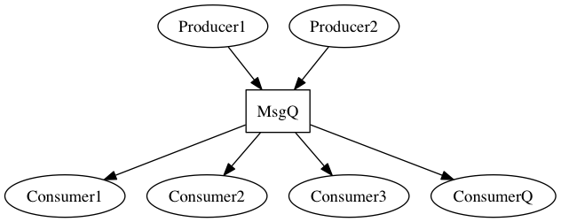

msgqsim
=======

Simulation of a message queue processing environemnt using simpy.

This is intended as a sandpit area for experimentation.

Of initial interest is exploring scheduling algorigthms in a processing
environment similar to that shown in the image below. The simulator
allows experimentation with various scheduling algorithms for selecting
messages from the message queues for processing by the consumers.
For example, what is the best algorithm to use if (a) all the messages 
take the same amount of time to process in the consumer or (b) different 
messages require different processing times within the consumer?

